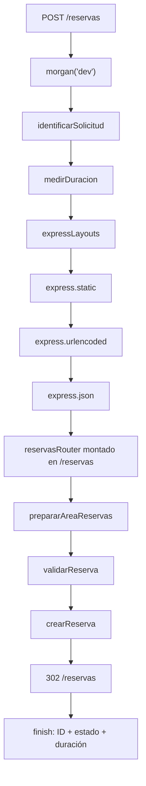
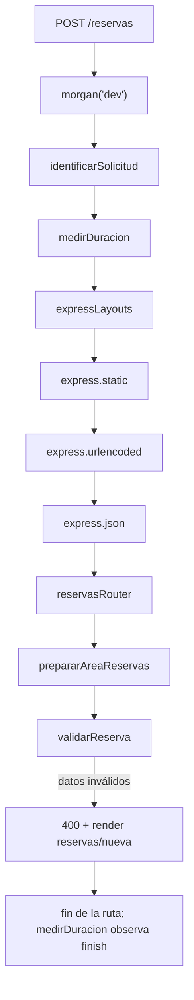

# Trabajo práctico 05

## Descripción
Aplicación web para consultar reservas temporales de salas de estudio y solicitar nuevos turnos. Está desarrollada con Express, EJS y un router de reservas definido dentro de `src/index.js`.

## Instalación
Requiere Node.js 18 o superior y npm. Desde esta carpeta, instala las dependencias:

```bash
npm install
```

## Ejecución
```bash
npm start
```

Abre `http://localhost:3000`. El puerto se puede cambiar con la variable de entorno `PORT`. Para comprobar la sintaxis:

```bash
npm run check
```

## Rutas
| Método | Ruta | Resultado |
| --- | --- | --- |
| GET | `/` | Inicio y enlaces de navegación. |
| GET | `/estado` | JSON con estado del servicio, cantidad de reservas e ID de solicitud. |
| GET | `/reservas` | Listado o mensaje alternativo si no hay reservas. |
| GET | `/reservas/nueva` | Formulario etiquetado para una reserva. |
| GET | `/reservas/:id` | Detalle completo; 404 HTML si el ID no existe. |
| POST | `/reservas` | Valida y agrega la reserva temporal; redirige al listado. |
| Cualquier otra | — | Página HTML 404 al final del pipeline. |

## Pipeline de middleware
El orden global de `app.use` registra primero Morgan y las dos funciones personalizadas. `expressLayouts` prepara el renderizado; `express.static` atiende los recursos públicos; los parsers quedan antes de las rutas para que `req.body` exista cuando se valide un POST. `GET /estado` es una ruta de aplicación y no usa el valor local que prepara el router.



En un POST inválido el validador responde y termina esa ruta. No ejecuta `next()` ni llega a `crearReserva`:



## Alcance de cada función
- **Middleware de terceros:** `morgan('dev')` registra método, URL, estado y tiempo HTTP en la terminal.
- **Middleware incorporado:** `express.static` sirve CSS; `express.urlencoded` interpreta el formulario; `express.json` interpreta cuerpos JSON.
- **Middleware personalizado global:** `identificarSolicitud` genera IDs consecutivos `BIB-0001`, los guarda en `res.locals.solicitudId` y los hace disponibles para vistas y `/estado`. `medirDuracion` mide desde el inicio hasta el evento `finish`, cuando ya se conoce el estado final.
- **Middleware de router:** `prepararAreaReservas` define `res.locals.seccion` antes de las rutas bajo `/reservas`. El montaje `app.use('/reservas', reservasRouter)` antepone ese prefijo a las rutas internas `/`, `/nueva` y `/:id`.
- **Middleware de ruta:** `validarReserva` se ejecuta sólo en el POST. Si los datos son correctos, prepara `req.reservaValidada` y usa `next()` para pasar a `crearReserva`; si son incorrectos, renderiza la respuesta 400 y termina ahí.

`next()` se usa cuando un middleware ya preparó lo necesario y debe permitir que continúe el ciclo. No se llama después de enviar una respuesta final. Los parsers deben preceder a la validación porque ésta consume `req.body`. El evento `finish` permite medir la respuesta completa, no sólo el tiempo hasta entrar al handler. El POST válido responde 302 para que el navegador haga luego un GET independiente a `/reservas` (patrón POST-redirect-GET), evitando reenviar el formulario al recargar.

## Validación
La validación del servidor recorta los textos, exige estudiante, email, sala, fecha, turno y cantidad, comprueba que el email incluya `@`, limita la sala a `Sala Norte`, `Sala Sur` o `Sala Multimedia`, restringe el turno a `Mañana`, `Tarde` o `Noche` y exige un entero de personas entre 1 y 6. Ante error responde 400, muestra un mensaje `role="alert"` y conserva los valores ingresados. Ante éxito prepara los datos normalizados para el handler, sin duplicar allí las validaciones.

## Pruebas manuales
1. Ejecuta `npm run check` y `npm start`.
2. Abre `/`, `/estado`, `/reservas` y `/reservas/nueva`; confirma navegación y el ID discreto del pie.
3. Abre `/reservas/1` y `/reservas/999`; verifica detalle y 404 HTML.
4. Envía el formulario vacío, con sala/turno inválido, email sin `@`, personas `0` y personas `7`; cada intento debe responder 400, mantener los valores y no crear una reserva.
5. Envía una reserva válida; debe responder 302 a `/reservas`, donde se ve la tarjeta nueva. Morgan y `medirDuracion` deben registrar los estados 200, 302, 400 y 404.
6. Para probar el estado vacío, deja temporalmente el arreglo inicial sin elementos, visita `/reservas`, y luego restaura los cuatro registros.
7. Reinicia el servidor: la reserva recién creada ya no debe aparecer y `/estado` debe volver a indicar cuatro reservas.

## Persistencia temporal
Las cuatro reservas iniciales están definidas en memoria en `src/index.js`. Las nuevas reservas sólo se agregan al arreglo durante la ejecución; no se escriben a archivos ni a una base de datos. Por eso, al reiniciar el proceso vuelven a quedar únicamente los cuatro registros iniciales. `node_modules/` y `.env` están excluidos por `.gitignore`.